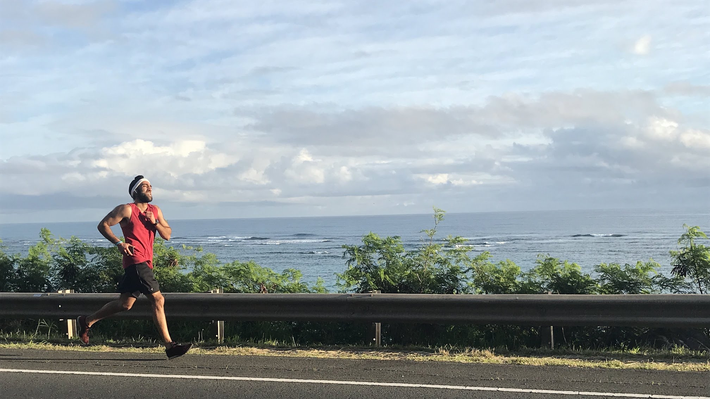
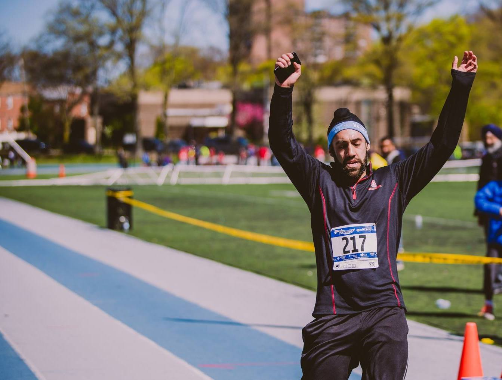

<!-- ## Upcoming Races
# | Date           | Event                                  | Type          | Location                       |
# | -------------- | -------------------------------------- | ------------- | ------------------------------ |
-->

## Past Races

| Date           | Event                 | Type          | Location                       | Rank | Racer Count | Time    | Pace  |
| -------------- | --------------------- | ------------- | ------------------------------ | ---  | ------------| ------- | ----- |
| 01 June 2019   | [Bass Lake Yosemite Tri][12] | 5K     | Bass Lake Yosemite, CA                | [6][12b]    | 75           | 6:54   | 21:25 |
| 19 May 2019   | [Bay to Breakers][11] | 12K            | San Francisco, CA                | [692][11b]    | 16648           | 55:43   | 7:29 |
| 01 Jan 2019   | [Commitment Day 5K][10] | 5K            | Long Island, NY                | 4    | 80+           | 21:08   | 6:50 |
| 11 Aug 2018   | [Courage Over Cancer][9] | 10K         | Crissy Fields, San Francisco, CA| [19][9b] | 160 | 45:55 | 7:24 |
| 17-18 Feb 2018 | [Hoku Relay][5]       | 134 Mile Group Relay (Personal 16.1 miles within 3 legs) | Oahu, Hawaii | 2 | N/A (Relay) | N/A (Relay) | N/A (Relay) |
| 07 Jan 2018   | [Hot Chocolate 15K][4] | 15K           | Golden Gate Park, San Francisco, CA| [119][4b] | 5,428 | 1:08:06 | 7:19 |
| 01 Jan 2018   | [Commitment Day 5K][8] | 5K            | Long Island, NY *Windchill Temp: [-1℉][8b] | 1   | ~40          | 21:44 | 6:59 |
| 12 Nov 2017   | [Blazing Trails for Autism][7] | 4mi  | Great Neck, Long Island, NY | [21][7b]   | 405    | 27:33 | 6:44 |
| 12 Aug 2017   | [NYCRUNS Governors Island 5K & 10K][3] | 10K  | Nolan Park, Governors Island, NY | [21][3b]   | 518    | 43:43 | 6:58 |
| 17 June 2017   | [Rockapulco Run][1]        | Half Marathon | Rockaway Beach, NY             | [12][1b]   | 126         | 1:42:02 | 07:47 |
| 14 May 2017    | Long Island 5K Run    | 5K            | Eisenhower Park, Woodhaven, NY | 4    | 100+        | 20:31 | 06:36 |
| 23 April 2017  | [Vasakhi 5K][2]       | 5K            | Victory Field, Woodhaven, NY   | 3    | 200+        |  20:16 | 06:31 |
| 24 April 2016  | [Vasakhi 5K][2]       | 5K            | Victory Field, Woodhaven, NY   | 7    | 200+        |  20:13 | 06:30 |

[1]: http://www.rockapulcorun.com/
[1b]: http://timing.boardwalkrunning.com/2017-Fathers-Day-Half-Marathon-Rockaway-Park-NY?status=live
[2]: https://www.vaisakhi5k.com/
[3]: https://nycruns.com/races/?race=nycruns-firecracker-5k--10k
[3b]: https://nycruns.com/race-results/?race=NYCRUNS-governors-island-5k-10k-2
[4]: https://www.hotchocolate15k.com/sanfrancisco/race
[4b]: https://hub.enmotive.com/events/2018-hot-chocolate-15k-5k-san-francisco/registrants/54273-dasmer-singh
[5]: http://hokurelay.com/
[6]: https://baytobreakers.com/
[7]: https://runsignup.com/Race/NY/GreatNeck/BlazingTrail4MileRunWalkforAutism
[7b]: http://jms.racetecresults.com/results.aspx?CId=16370&RId=290
[8]: https://www.facebook.com/events/563070407358375/
[8b]:https://www.wunderground.com/history/airport/KFRG/2018/1/1/DailyHistory.html?req_city=Syosset&req_state=NY&req_statename=New+York&reqdb.zip=11773&reqdb.magic=1&reqdb.wmo=99999
[9]: https://www.courageovercancersf.com/
[9b]: https://www.athlinks.com/event/249682/results/Event/755569/Course/1279433/Bib/2157
[10]: https://www.facebook.com/events/287568968780244/
[11]: https://www.baytobreakers.com/
[11b]: http://onlineraceresults.com/race/view_individual.php?make_printable=1&bib_num=25701&race_id=67794&type=result
[12]: http://www.basslaketri.com/
[12b]: http://www.cincyhalfmarathon.com/Results/basslake19.5k.htm
